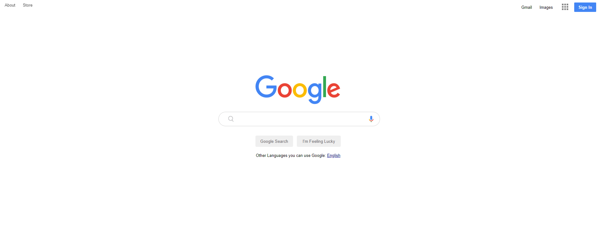

## Project: Google Landing Page

## Description

Project aims to create google landing page.

## Project Skeleton

```
google-landing-page (folder)
|
|----readme.md
|----images
        |----appicon.png
        |----gfavicon.png
	|----google_microphone.png
	|----googlelogo.png
	|----icon-menu.jpg
	|----magnifying_glass.png
|----index.html
|----style.css
|----images
```

## Objective

Build a Landing that is functionally similar to this: [Google Landing Page](https://aaron-clarusway.github.io/google-landing--page/)

### At the end of the project, following topics are to be covered;

- HTML

- List Properties-Tables / CSS-The Display Property-The position Property

- Overflow Property-The float Property-Opacity / Transparency-Units in CSS

- CSS Setting height and width-CSS Outline-CSS Combinators

### At the end of the project, i will be able to;

- improve coding skills within HTML & CSS

- use git commands (push, pull, commit, add etc.) and Github as Version Control System.
